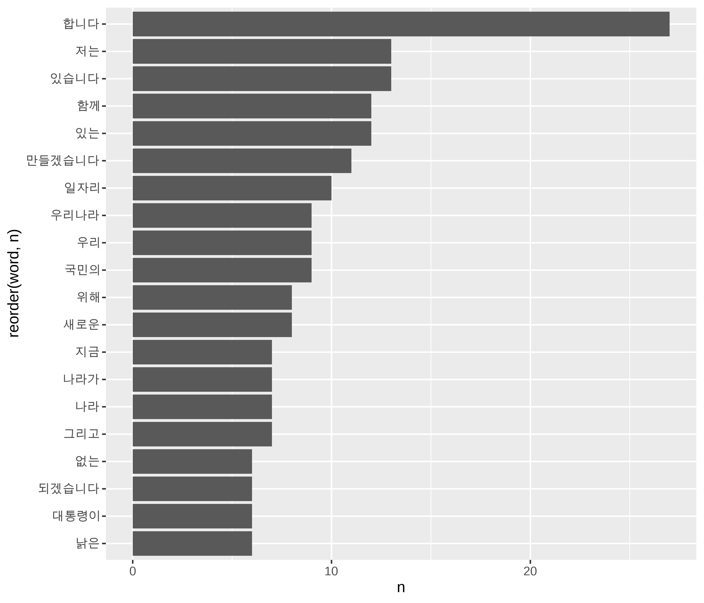
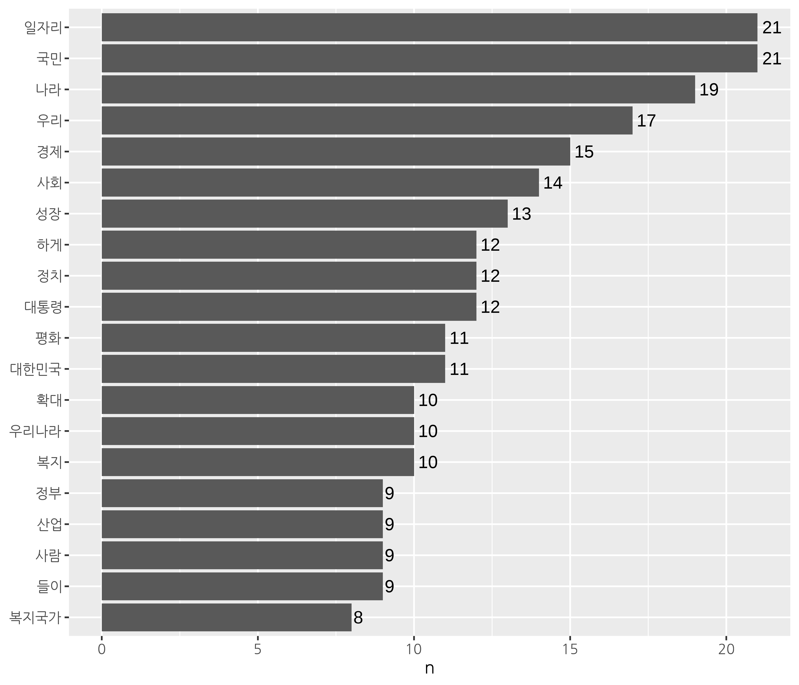
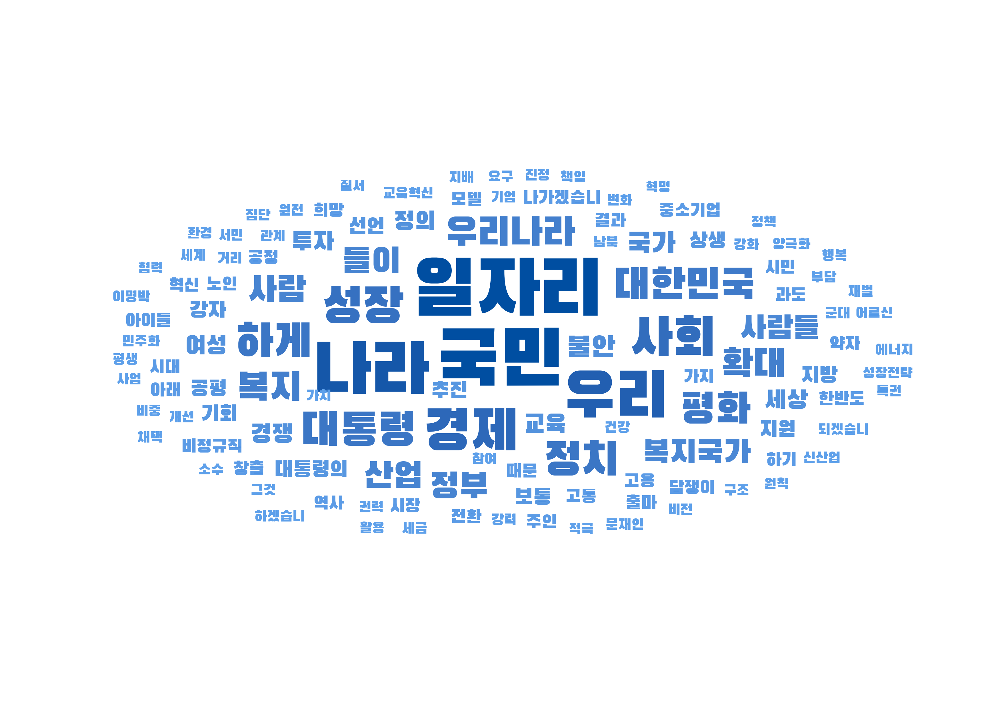
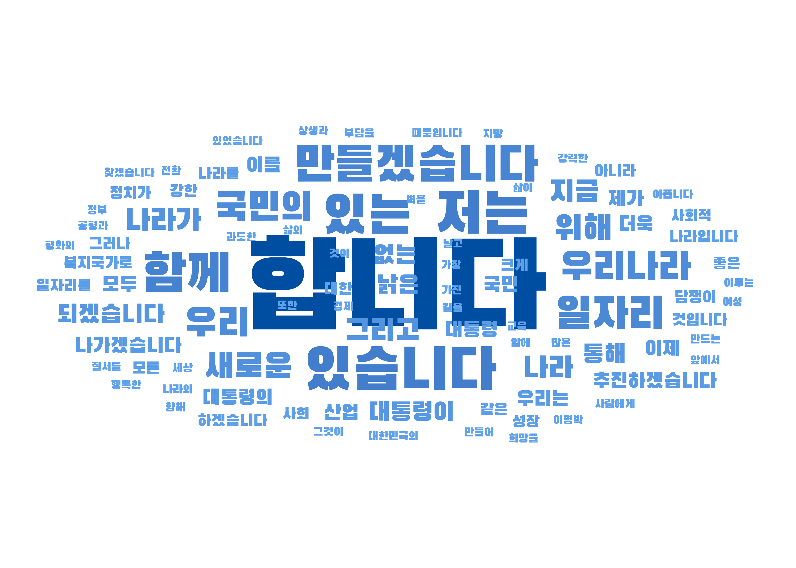

```{r setup, include=FALSE}
options(htmltools.dir.version = FALSE, 
        width = 70, 
        max.print = 80,
        tibble.print_max = 40,
        tibble.width = 70,
        servr.interval = 0.01) # Viewer 수정 반영 속도

knitr::opts_chunk$set(cache = T, warning = F, message = F, 
                      dpi = 300, fig.height = 4, out.width = "100%")

xaringanExtra::use_tile_view()

library(knitr)
library(icon)
library(here)
```


```{r echo=FALSE}
rm(list = ls())

library(showtext)
font_add_google(name = "Nanum Gothic", family = "nanumgothic")
showtext_auto()

# code highlighting
hook_source <- knitr::knit_hooks$get('source')
knitr::knit_hooks$set(source = function(x, options) {
  x <- stringr::str_replace(x, "^[[:blank:]]?([^*].+?)[[:blank:]]*#<<[[:blank:]]*$", "*\\1")
  hook_source(x, options)
})


```


class: title0

텍스트를 쉽게 분석하는 방법


---

class: no-page-num

<br>

.pull-left[
&nbsp;&nbsp;&nbsp;&nbsp;&nbsp;&nbsp;&nbsp;&nbsp;
```{r, echo=FALSE, out.width="70%", out.height="70%"}
include_graphics("https://raw.githubusercontent.com/youngwoos/Doit_textmining/main/cover.png")
```
]

.pull-right[

<br>
<br>
<br>

`r fontawesome("github")` [github.com/youngwoos/Doit_textmining](https://github.com/youngwoos/Doit_textmining)

`r fontawesome("facebook-square")` [facebook.com/groups/datacommunity](https://facebook.com/groups/datacommunity)

- [네이버책](https://book.naver.com/bookdb/book_detail.nhn?bid=17891971)
  - [yes24](http://bit.ly/3oUuJOB)
  - [알라딘](http://bit.ly/3oXOSDn)
  - [교보문고](https://bit.ly/2LtNOcB)
]

---

class: title0

01 단어 빈도 분석:
<br>
무엇을 강조했을까?

---

<br>

.large2[.font-jua[목차]]

.large[.font-jua[01-1 토큰화하기]]([link](#01-1))

.large[.font-jua[01-2 단어 빈도 분석하기]]([link](#01-2))


---


name: 01-1
class: title1

01-1 토큰화하기

---

#### 토큰화(tokenization)
- 토큰(token): 텍스트의 기본 단위(ex: 단락, 문장, 단어, 형태소)
- 토큰화: 텍스트를 토큰으로 나누는 작업

--

#### `tidytext` 패키지
  - 텍스트를 정돈된 데이터(Tidy Data) 형태를 유지하며 분석
  - `dplyr`, `ggplot2` 패키지와 함께 활용
  - 토큰화하기: `unnest_tokens()`

---

##### 샘플 텍스트로 작동 원리 알아보기

```{r}
library(dplyr)
text <- tibble(value = "대한민국은 민주공화국이다. 대한민국의 주권은 국민에게 있고, 모든 권력은 국민으로부터 나온다.")

text
```


---

```{r eval=F}
install.packages("tidytext")
library(tidytext)

# 문장 기준 토큰화
text %>%
  unnest_tokens(input = value,        # 토큰화할 텍스트
                output = word,        # 토큰을 담을 변수명
                token = "sentences")  # 문장 기준
```

```{r echo=F}
# install.packages("tidytext")
library(tidytext)

# 문장 기준 토큰화
text %>%
  unnest_tokens(input = value,        # 토큰화할 텍스트
                output = word,        # 토큰을 담을 변수명
                token = "sentences")  # 문장 기준 #<<
```

---

```{r}
# 띄어쓰기 기준 토큰화
text %>%
  unnest_tokens(input = value,
                output = word,
                token = "words")      # 띄어쓰기 기준 #<<
```

---
<br-10>

.scroll-box-26[
```{r}
# 문자 기준 토큰화
text %>%
  unnest_tokens(input = value,
                output = word,
                token = "characters")  # 문자 기준 #<<
```
]


---

#### 형태소 추출

```{r}
library(KoNLP)
extractNoun(text$value)
```

---

```{r}
text <- text %>%
  unnest_tokens(input = value,
                output = word,
                token = "sentences")

text
```

---

```{r}
# 형태소 추출
text %>%
  unnest_tokens(input = word,
                output = word,
                token = extractNoun) # 명사 기준 #<<

```


---

name: 01-2
class: title1


01-2 단어 빈도 분석하기

---


#### 연설문에서 명사 추출하기

##### 문재인 대통령 연설문 불러오기

```{r eval=F}
raw_moon <- readLines("speech_moon.txt", encoding = "UTF-8")
```

##### 기본적인 전처리
```{r eval=F}
library(stringr)
library(textclean)

moon <- raw_moon %>%
  str_replace_all("[^가-힣]", " ") %>%  # 한글만 남기기
  str_squish() %>%                      # 중복 공백 제거
  as_tibble()                           # tibble로 변환

moon
```

---

```{r echo=F}
# 문재인 대통령 연설문 불러오기
raw_moon <- readLines("../Data/speech_moon.txt", encoding = "UTF-8")

# 기본적인 전처리
library(stringr)
library(textclean)

moon <- raw_moon %>%
  str_replace_all("[^가-힣]", " ") %>%  # 한글만 남기기
  str_squish() %>%                      # 중복 공백 제거
  as_tibble()                           # tibble로 변환

moon
```

---

##### 명사 기준 토큰화
```{r}
word_noun <- moon %>%
  unnest_tokens(input = value,
                output = word,
                token = extractNoun)

word_noun
```


---

##### 단어 빈도 구하기

- 빈도가 높은 명사를 보면 글쓴이가 무엇을 강조했는지 알 수 있음
- `# A tibble: 704 x 2`: 연설문이 704개의 명사로 구성됨

```{r}
word_noun <- word_noun %>%
  count(word, sort = T) %>%    # 단어 빈도 구해 내림차순 정렬
  filter(str_count(word) > 1)  # 두 글자 이상만 남기기

word_noun
```

---

.pull-left[

##### 띄어쓰기 기준 추출
```{r}
moon %>%
  unnest_tokens(input = value,
                output = word,
                token = "words") %>% #<<
  count(word, sort = T) %>%
  filter(str_count(word) > 1)

```
]

.pull-right[

##### 명사 추출
```{r}
moon %>%
  unnest_tokens(input = value,
                output = word,
                token = extractNoun) %>% #<<
  count(word, sort = T) %>%
  filter(str_count(word) > 1)

```

]

---

##### 막대 그래프 만들기

.scroll-box-26[

```{r}
# 상위 20개 단어 추출
top20 <- word_noun %>%
  head(20)

top20
```
]

---

```{r eval=F}
# 막대 그래프 만들기
library(ggplot2)

ggplot(top20, aes(x = reorder(word, n), y = n)) +
  geom_col() +
  coord_flip() +
  geom_text(aes(label = n), hjust = -0.3) +
  labs(x = NULL) +
  theme(text = element_text(family = "nanumgothic"))
```

---

- 명사로 되어있기 때문에 연설문의 내용을 이해하기 쉬움

```{r echo=F, fig.height = 5, out.width = "80%"}
showtext_opts(dpi = 300) # opts_chunk$set(dpi=300)

library(ggplot2)
ggplot(top20, aes(x = reorder(word, n), y = n)) +
  geom_col() +
  coord_flip() +
  geom_text(aes(label = n), hjust = -0.3) +
  labs(x = NULL) +
  theme(text = element_text(family = "nanumgothic"))
```

---

<br>

.pull-left[

##### &nbsp;&nbsp;&nbsp;&nbsp;&nbsp;&nbsp;&nbsp;&nbsp;&nbsp;&nbsp;&nbsp;&nbsp;&nbsp;&nbsp;&nbsp;띄어쓰기 기준 추출

```{r, echo=FALSE}

```
]

.pull-right[

##### &nbsp;&nbsp;&nbsp;&nbsp;&nbsp;&nbsp;&nbsp;&nbsp;&nbsp;&nbsp;&nbsp;&nbsp;&nbsp;&nbsp;&nbsp;명사 추출
```{r, echo=FALSE}

```
]

---

##### 워드 클라우드 만들기

```{r eval=F}
# 폰트 설정
library(showtext)
font_add_google(name = "Black Han Sans", family = "blackhansans")
showtext_auto()

library(ggwordcloud)
ggplot(word_noun, aes(label = word, size = n, col = n)) +
  geom_text_wordcloud(seed = 1234, family = "blackhansans") +
  scale_radius(limits = c(3, NA),
               range = c(3, 15)) +
  scale_color_gradient(low = "#66aaf2", high = "#004EA1") +
  theme_minimal()
```

---
<br-back-50>

```{r echo=F}

```

---

<br>

.pull-left[

##### &nbsp;&nbsp;&nbsp;&nbsp;&nbsp;&nbsp;&nbsp;&nbsp;&nbsp;&nbsp;&nbsp;&nbsp;&nbsp;&nbsp;&nbsp;띄어쓰기 기준 추출

<br-back-10>

```{r, echo=FALSE, out.width="90%", out.height="90%"}

```
]

.pull-right[

##### &nbsp;&nbsp;&nbsp;&nbsp;&nbsp;&nbsp;&nbsp;&nbsp;&nbsp;&nbsp;&nbsp;&nbsp;&nbsp;&nbsp;&nbsp;&nbsp;&nbsp;&nbsp;&nbsp;&nbsp;&nbsp;&nbsp;&nbsp;&nbsp;&nbsp;&nbsp;&nbsp;&nbsp;&nbsp;명사 추출

<br-back-20>

```{r, echo=FALSE}

```
]

