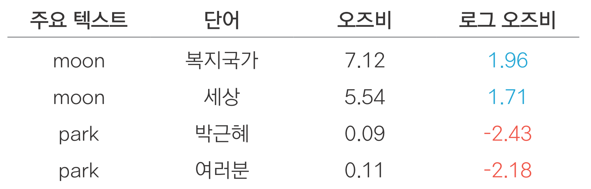

```{r include=FALSE}
options(htmltools.dir.version = FALSE, 
        width = 80,
        # width = 70,
        
        max.print = 80,
        tibble.print_max = 40,
        
        tibble.width = 80,
        # tibble.width = 70,
        
        # pillar.min_chars = Inf, # tibble 문자 출력 제한
        servr.interval = 0.01) # Viewer 수정 반영 속도


knitr::opts_chunk$set(cache = T, warning = F, message = F, 
                      dpi = 300, fig.height = 4, out.width = "100%")

# xaringanExtra::use_tile_view()

library(knitr)
library(icon)
library(here)
```


```{r echo=FALSE}
rm(list = ls())

library(showtext)
font_add_google(name = "Nanum Gothic", family = "nanumgothic")
showtext_auto()
showtext_opts(dpi = 300) # opts_chunk$set(dpi=300)

# code highlighting
hook_source <- knitr::knit_hooks$get('source')
knitr::knit_hooks$set(source = function(x, options) {
  x <- stringr::str_replace(x, "^[[:blank:]]?([^*].+?)[[:blank:]]*#<<[[:blank:]]*$", "*\\1")
  hook_source(x, options)
})


```


class: title0

02 비교 분석: 무엇이 다를까?

---

<br>

.large2[.font-jua[목차]]

.large[.font-jua[02-1 단어 빈도 비교하기]]([link](#02-1))

.large[.font-jua[02-2 오즈비 - 상대적으로 중요한 단어 비교하기]]([link](#02-2))

.large[.font-jua[02-3 TF-IDF - 여러 텍스트의 단어 비교하기]]([link](#02-3))

---


name: 02-1
class: title1

02-1 단어 빈도 비교하기

---

### 비교 분석
- 여러 텍스트를 비교해 차이를 알아보는 분석 방법
- 단어 빈도 분석을 응용해 자주 사용된 단어의 차이를 살펴봄

---

### 텍스트 합치기

- 텍스트를 비교하기 위해 여러 개의 텍스트를 하나의 데이터셋으로 합치는 작업

##### 데이터 불러오기

- 문재인 대통령과 박근혜 전 대통령의 대선 출마 선언문 불러오기
- tibble 구조로 변환하고 연설문 구분 위해 대통령 이름 부여

```{r eval=FALSE}
library(dplyr)

# 문재인 대통령 연설문 불러오기
raw_moon <- readLines("speech_moon.txt", encoding = "UTF-8")
moon <- raw_moon %>%
  as_tibble() %>%
  mutate(president = "moon")

# 박근혜 대통령 연설문 불러오기
raw_park <- readLines("speech_park.txt", encoding = "UTF-8")
park <- raw_park %>%
  as_tibble() %>%
  mutate(president = "park")
```

```{r echo=F}
library(dplyr)

# 문재인 대통령 연설문 불러오기
raw_moon <- readLines("../Data/speech_moon.txt", encoding = "UTF-8")

moon <- raw_moon %>%
  as_tibble() %>%
  mutate(president = "moon")

# 박근혜 대통령 연설문 불러오기
raw_park <- readLines("../Data/speech_park.txt", encoding = "UTF-8")

park <- raw_park %>%
  as_tibble() %>%
  mutate(president = "park")
```

---

##### 데이터 합치기

```{r}
bind_speeches <- bind_rows(moon, park) %>%
  select(president, value)
```

---


#### 집단별 단어 빈도 구하기

##### 기본적인 전처리 및 토큰화

- 한글 이외의 문자, 연속된 공백 제거
- `bind_speeches`는 tibble 구조이므로 `mutate()` 활용


```{r eval=FALSE}
# 기본적인 전처리
library(stringr)
speeches <- bind_speeches %>%
  mutate(value = str_replace_all(value, "[^가-힣]", " "),
         value = str_squish(value))

speeches
```
---

```{r echo=FALSE, R.options=list(tibble.width = 50)}
# 기본적인 전처리
library(stringr)
speeches <- bind_speeches %>%
  mutate(value = str_replace_all(value, "[^가-힣]", " "),
         value = str_squish(value))

speeches
```


---

- 형태소 분석기를 이용해 명사 기준 토큰화


```{r}
# 토큰화
library(tidytext)
library(KoNLP)

speeches <- speeches %>%
  unnest_tokens(input = value,
                output = word,
                token = extractNoun)

```

---

##### 두 연설문의 단어 빈도 구하기

```{r}
frequency <- speeches %>%
  count(president, word) %>%   # 연설문 및 단어별 빈도
  filter(str_count(word) > 1)  # 두 글자 이상 추출

head(frequency)
```

`r fontawesome("lightbulb")`  `count()`는 입력한 변수의 알파벳, 가나다순으로 행을 정렬함

---


#### 연설문에 가장 많이 사용된 단어 추출하기

- `president`별 고빈도 단어 상위 10개 추출


```{r eval = F}
top10 <- frequency %>%
  group_by(president) %>%
  slice_max(n, n = 10, with_ties = F)

top10

```

---

```{r, echo=FALSE}
top10 <- frequency %>%
  group_by(president) %>%
  slice_max(n, n = 10, with_ties = F)

top10

```

---

#### 막대 그래프 만들기

```{r eval=F}
ggplot(top10, aes(x = reorder(word, n),
                  y = n,
                  fill = president)) +
  geom_col() +
  coord_flip() +
  facet_wrap(~ president,         # president별 그래프 생성
              scales = "free_y")  # y축 통일하지 않음
```

---

```{r echo=F}
ggplot(top10, aes(x = reorder(word, n),
                  y = n,
                  fill = president)) +
  geom_col() +
  coord_flip() +
  facet_wrap(~ president,         # president별 그래프 생성
              scales = "free_y")  # y축 통일하지 않음
```

---

#### 특정 단어 제외하고 막대 그래프 만들기

- 박근혜 전 대통령 `"국민"` 빈도 너무 높아 다른 단어들 차이 드러나지 않음
- 전반적인 단어 빈도가 잘 드러나도록 제거

```{r}
top10 <- frequency %>%
  filter(word != "국민") %>%
  group_by(president) %>%
  slice_max(n, n = 10, with_ties = F)
```

```{r eval = F}
ggplot(top10, aes(x = reorder_within(word, n, president),  # 변수 항목별 축 순서 구하기
                  y = n,
                  fill = president)) +
  geom_col() +
  coord_flip() +
  facet_wrap(~ president, scales = "free_y") +
  scale_x_reordered() +
  labs(x = NULL) +                                         # x축 삭제
  theme(text = element_text(family = "nanumgothic"))       # 폰트
```

---

```{r echo = F}
ggplot(top10, aes(x = reorder_within(word, n, president), # 변수 항목별 축 순서 구하기
                  y = n,
                  fill = president)) +
  geom_col() +
  coord_flip() +
  facet_wrap(~ president, scales = "free_y") +
  scale_x_reordered() +
  labs(x = NULL) +                                        # x축 삭제
  theme(text = element_text(family = "nanumgothic"))      # 폰트
```


---
name: 02-2
class: title1

02-2 오즈비:
<br>
상대적으로  중요한 단어 비교하기

---

- 빈도 높은 단어를 비교하면
  - 어떤 텍스트든 일반적인 단어 빈도 높아 텍스트 차이 잘 드러나지 않음
     - ex) 연설문: `"우리"`, `"사회"`, `"경제"`, `"일자리"`


- 텍스트의 차이를 알아보려면
  - 특정 텍스트에는 많이 사용되었지만 다른 텍스트에는 적게 사용된 단어를 살펴봐야함

---


##### 오즈비(odds ratio)
  - 어떤 사건이 A 조건에서 발생할 확률이 B 조건에서 발생할 확률에 비해 얼마나 더 큰지를 나타냄
  - 단어가 두 텍스트 중 어디에 등장할 확률이 높은지, 상대적인 중요도를 알 수 있음

--

<br>

.pull-left[

$${\large\text{odds ratio} = \frac{\left(\frac{n+1}{\text{total}+1}\right)_\text{Text A}}
                           {\left(\frac{n+1}{\text{total}+1}\right)_\text{Text B}}}$$

- $n$: 각 단어의 빈도
- $\text{total}$: 전체 단어 빈도

]

---

##### 연설문 단어 빈도를 Wide form으로 변환하기

```{r}
library(tidyr)
frequency_wide <- frequency %>%
  pivot_wider(names_from = president,
              values_from = n,
              values_fill = list(n = 0))

frequency_wide
```


#### 오즈비 구하기

```{r}
frequency_wide <- frequency_wide %>%
  mutate(odds_ratio = ((moon + 1)/(sum(moon + 1)))/
                      ((park + 1)/(sum(park + 1))))
```
---


- 오즈비를 보면 단어가 어떤 텍스트에서 상대적으로 더 많이 사용됐는지 알 수 있음
  - `"moon"`에서 상대적인 비중 클수록 1보다 큰 값
  - `"park"`에서 상대적인 비중 클수록 1보다 작은 값
  - 두 연설문에서 단어 비중 같으면 1

```{r}
frequency_wide %>%
  arrange(-odds_ratio) #<<
```

---

#### 상대적으로 중요한 단어 추출하기

##### 오즈비가 가장 높거나 가장 낮은 단어 추출하기

```{r}
top10 <- frequency_wide %>%
  filter(rank(odds_ratio) <= 10 | rank(-odds_ratio) <= 10)
```

---

- 상위 10개: `"moon"`에서 더 자주 사용되어 `odds_ratio`가 높은 단어

```{r echo=F, highlight.output=c(4:13)}
top10 %>%
  arrange(-odds_ratio)
```

---

- 하위 10개: `"park"`에서 더 자주 사용되어 `odds_ratio`가 낮은 단어

```{r echo=F, highlight.output=c(14:23)}
top10 %>%
  arrange(-odds_ratio)
```


---


#### 막대 그래프 만들기


```{r R.options=list(tibble.print_max = 10)}
# 비중이 큰 연설문을 나타낸 변수 추가하기
top10 <- top10 %>%
  mutate(president = ifelse(odds_ratio > 1, "moon", "park"),
         n = ifelse(odds_ratio > 1, moon, park))

top10
```


---

```{r eval=F}
ggplot(top10, aes(x = reorder_within(word, n, president),
                  y = n,
                  fill = president)) +
  geom_col() +
  coord_flip() +
  facet_wrap(~ president, scales = "free") + 
  scale_x_reordered() +
  labs(x = NULL) +                                    # x축 삭제
  theme(text = element_text(family = "nanumgothic"))  # 폰트
```


---

```{r echo=F}
ggplot(top10, aes(x = reorder_within(word, n, president),
                  y = n,
                  fill = president)) +
  geom_col() +
  coord_flip() +
  facet_wrap(~ president, scales = "free") + 
  scale_x_reordered() +
  labs(x = NULL) +                                    # x축 삭제
  theme(text = element_text(family = "nanumgothic"))  # 폰트
```


---

### 로그 오즈비로 단어 비교하기


##### 로그 오즈비(log odds ratio)
- 오즈비에 로그를 취한 값
- 단어의 오즈비가 1보다 크면 `+`, 1보다 작으면 `-`가 됨
- 단어가 두 텍스트 중 어디에서 비중이 큰지에 따라 서로 다른 부호
  - `"moon"`에서 비중이 커서 `odds_ratio`가 1보다 큰 단어 `+`
  - `"park"`에서 비중이 커서 `odds_ratio`가 1보다 작은 단어 `-`

<br>

```{r, echo=F, out.width="60%", out.height="60%"}

```

---

##### 로그 오즈비(log odds ratio)
- 오즈비에 로그를 취한 값
- 단어의 오즈비가 1보다 크면 `+`, 1보다 작으면 `-`가 됨
- 단어가 두 텍스트 중 어디에서 비중이 큰지에 따라 서로 다른 부호
  - `"moon"`에서 비중이 커서 `odds_ratio`가 1보다 큰 단어 `+`
  - `"park"`에서 비중이 커서 `odds_ratio`가 1보다 작은 단어 `-`

<br>


.center[

$${\large\text{odds ratio} = \frac{\left(\frac{n+1}{\text{total}+1}\right)_\text{Text A}}
                           {\left(\frac{n+1}{\text{total}+1}\right)_\text{Text B}}}$$
]

---

#### 로그 오즈비 구하기


```{r}
frequency_wide <- frequency_wide %>%
  mutate(log_odds_ratio = log(((moon + 1) / (sum(moon + 1))) /
                              ((park + 1) / (sum(park + 1)))))
```


---

#### 로그 오즈비를 이용해 중요한 단어 비교하기

- 두 연설문 각각 `log_odds_ratio` Top 10 추출

```{r}
top10 <- frequency_wide %>%
  group_by(president = ifelse(log_odds_ratio > 0, "moon", "park")) %>%
  slice_max(abs(log_odds_ratio), n = 10, with_ties = F)

```

---

#### 막대 그래프 만들기

- 단어가 어느 연설문에서 중요한지에 따라 서로 다른 축 방향으로 표현됨

```{r fig.width=6, fig.height=4, out.width="45%"}
ggplot(top10, aes(x = reorder(word, log_odds_ratio),
                  y = log_odds_ratio,
                  fill = president)) +
  geom_col() +
  coord_flip() +
  labs(x = NULL) +
  theme(text = element_text(family = "nanumgothic"))
```

---

<br>
```{r echo=FALSE, fig.width=6, fig.height=4, out.width="80%"}
ggplot(top10, aes(x = reorder(word, log_odds_ratio),
                  y = log_odds_ratio,
                  fill = president)) +
  geom_col() +
  coord_flip() +
  labs(x = NULL) +
  theme(text = element_text(family = "nanumgothic"))
```

---

name: 02-3
class: title1

02-3 TF-IDF:
<br>
여러 텍스트의 단어 비교하기

---

##### 오즈비의 한계

- 두 조건의 확률을 이용해 계산
- 여러 텍스트 비교하기 불편
- 두 개 이상의 텍스트 비교할 때는 **TF-IDF** 활용

---


#### TF-IDF(Term Frequency - Inverse Document Frequency)
- 어떤 단어가 흔하지 않으면서도 특정 텍스트에서는 자주 사용된 정도를 나타낸 지표
- 텍스트의 개성을 드러내는 주요 단어를 찾는데 활용
- TF(단어 빈도)와 IDF(역 문서 빈도)를 곱한 값
  - TF: 단어가 분석 대상이 되는 텍스트 내에서 많이 사용될수록 커짐
  - IDF: 단어가 사용된 텍스트가 드물수록 커짐


<br>
<br-back-20>

$${\large\text{TF-IDF} = TF{\times}\log\frac{{\text{N}}}{{\text{DF}}}}$$

<br>


---

##### TF-IDF

- **흔하지 않은 단어**인데 **특정 텍스트에서 자주 사용**될수록 큰 값
  - TF-IDF가 큰 단어를 보면 다른 텍스트와 구별되는 특징을 알 수 있음

<br>
<br-back-30>

```{r, echo=F, out.width="60%", out.height="60%", fig.align='center'}
include_graphics("Image/etc/03_4_table3.png", dpi = 300)
```

.center[
`r fontawesome("lightbulb")` 소수점 둘째 자리에서 반올림하여 표기
]
---


#### TF-IDF 구하기


##### 1. 단어 빈도 구하기

```{r eval=F}
# 데이터 불러오기
install.packages("readr")
library(readr)

raw_speeches <- read_csv("speeches_presidents.csv")
raw_speeches
```

```{r echo=FALSE, R.options=list(tibble.width = 50)}
# install.packages("readr")
library(readr)
raw_speeches <- read_csv("../Data//speeches_presidents.csv")
raw_speeches
```

---

```{r eval=FALSE}
# 기본적인 전처리
speeches <- raw_speeches %>%
  mutate(value = str_replace_all(value, "[^가-힣]", " "),
         value = str_squish(value))

# 토큰화
speeches <- speeches %>%
  unnest_tokens(input = value,
                output = word,
                token = extractNoun)

# 단어 빈도 구하기
frequecy <- speeches %>%
  count(president, word) %>%
  filter(str_count(word) > 1)

frequecy
```


```{r echo=FALSE}
# 기본적인 전처리
speeches <- raw_speeches %>%
  mutate(value = str_replace_all(value, "[^가-힣]", " "),
         value = str_squish(value))

# 토큰화
speeches <- speeches %>%
  unnest_tokens(input = value,
                output = word,
                token = extractNoun)

# 단어 빈도 구하기
frequecy <- speeches %>%
  count(president, word) %>%
  filter(str_count(word) > 1)
```

---

```{r echo=FALSE}
frequecy
```

---

#### 3.4.2 TF-IDF 구하기

- `tidytext::bind_tf_idf()`
  - `term`     : 단어
  - `document` : 텍스트 구분 기준
  - `n`        : 단어 빈도


```{r eval=F}
frequecy <- frequecy %>%
  bind_tf_idf(term = word,           # 단어
              document = president,  # 텍스트 구분 기준
              n = n) %>%             # 단어 빈도
  arrange(-tf_idf)

frequecy
```


---

```{r echo=FALSE}
frequecy <- frequecy %>%
  bind_tf_idf(term = word,           # 단어
              document = president,  # 텍스트 구분 기준
              n = n) %>%             # 단어 빈도
  arrange(-tf_idf)

frequecy
```

`r fontawesome("lightbulb")` `tf`: 대상 텍스트의 전체 단어 수에서 해당 단어의 수가 차지하는 '비중'. 텍스트에 사용된 전체 단어 수가 &nbsp;&nbsp;&nbsp;&nbsp;많을수록 작아짐

---

##### TF-IDF가 높은 단어 살펴보기

- 텍스트의 특징을 드러내는 중요한 단어
- 각 대통령이 다른 대통령들과 달리 무엇을 강조했는지 알 수 있음

```{r}
frequecy %>% filter(president == "문재인")
```

---

##### TF-IDF가 높은 단어 살펴보기

- 텍스트의 특징을 드러내는 중요한 단어
- 각 대통령이 다른 대통령들과 달리 무엇을 강조했는지 알 수 있음

```{r}
frequecy %>% filter(president == "박근혜")
```

---

##### TF-IDF가 높은 단어 살펴보기

- 텍스트의 특징을 드러내는 중요한 단어
- 각 대통령이 다른 대통령들과 달리 무엇을 강조했는지 알 수 있음

```{r}
frequecy %>% filter(president == "이명박")
```

---

##### TF-IDF가 높은 단어 살펴보기

- 텍스트의 특징을 드러내는 중요한 단어
- 각 대통령이 다른 대통령들과 달리 무엇을 강조했는지 알 수 있음

```{r}
frequecy %>% filter(president == "노무현")
```


---


##### TF-IDF가 낮은 단어 살펴보기

- 역대 대통령들이 공통적으로 사용한 흔한 단어, 범용 단어

```{r}
frequecy %>%
  filter(president == "문재인") %>%
  arrange(tf_idf)
```

---

##### TF-IDF가 낮은 단어 살펴보기

- 역대 대통령들이 공통적으로 사용한 흔한 단어, 범용 단어

```{r}
frequecy %>%
  filter(president == "박근혜") %>%
  arrange(tf_idf)
```

---

#### 막대 그래프 만들기

```{r eval=F}
# 주요 단어 추출
top10 <- frequecy %>%
  group_by(president) %>%
  slice_max(tf_idf, n = 10, with_ties = F)

# 그래프 순서 정하기
top10$president <- factor(top10$president,
                          levels = c("문재인", "박근혜", "이명박", "노무현"))

# 막대 그래프 만들기
ggplot(top10, aes(x = reorder_within(word, tf_idf, president),
                  y = tf_idf,
                  fill = president)) +
  geom_col(show.legend = F) +
  coord_flip() +
  facet_wrap(~ president, scales = "free", ncol = 2) +
  scale_x_reordered() +
  labs(x = NULL) +
  theme(text = element_text(family = "nanumgothic"))
```

---

```{r echo=F, fig.width=6, fig.height=5, out.width="75%"}
# 주요 단어 추출
top10 <- frequecy %>%
  group_by(president) %>%
  slice_max(tf_idf, n = 10, with_ties = F)

# 그래프 순서 정하기
top10$president <- factor(top10$president,
                          levels = c("문재인", "박근혜", "이명박", "노무현"))

# 막대 그래프 만들기
ggplot(top10, aes(x = reorder_within(word, tf_idf, president),
                  y = tf_idf,
                  fill = president)) +
  geom_col(show.legend = F) +
  coord_flip() +
  facet_wrap(~ president, scales = "free", ncol = 2) +
  scale_x_reordered() +
  labs(x = NULL) +
  theme(text = element_text(family = "nanumgothic"))
```
