```{r include=FALSE}
options(htmltools.dir.version = FALSE, 
        width = 80,
        # width = 70,
        
        max.print = 80,
        tibble.print_max = 40,
        
        tibble.width = 80,
        # tibble.width = 70,
        
        # pillar.min_chars = Inf, # tibble 문자 출력 제한
        servr.interval = 0.01) # Viewer 수정 반영 속도


knitr::opts_chunk$set(cache = T, warning = F, message = F, 
                      dpi = 300, fig.height = 4)
                      # out.width = "100%"

xaringanExtra::use_tile_view()

library(knitr)
library(icon)
library(here)
```


```{r echo=FALSE}
rm(list = ls())

library(showtext)
font_add_google(name = "Nanum Gothic", family = "nanumgothic")
showtext_auto()
showtext_opts(dpi = 300) # opts_chunk$set(dpi=300)

# code highlighting
hook_source <- knitr::knit_hooks$get('source')
knitr::knit_hooks$set(source = function(x, options) {
  x <- stringr::str_replace(x, "^[[:blank:]]?([^*].+?)[[:blank:]]*#<<[[:blank:]]*$", "*\\1")
  hook_source(x, options)
})


```

class: title0

03 의미망 분석: <br> 어떤 맥락에서 단어를 썼을까?

---

<br>

.large2[.font-jua[목차]]

.large[.font-jua[03-1 동시 출현 단어 분석: Co-occurrence analysis]]([link](#03-1))

.large[.font-jua[03-2 동시 출현 네트워크: Co-occurrence network]]([link](#03-2))

.large[.font-jua[03-3 단어 간 상관 분석: Phi coefficient]]([link](#03-3))

.large[.font-jua[03-4 연이어 사용된 단어쌍 분석: n-gram]]([link](#03-4))


---

name: 03-1
class: title1

03-1 동시 출현 단어 분석:  
Co-occurrence analysis

---

##### 동시 출현 단어 분석(Co-occurrence analysis)

- 단어 간의 관계를 살펴보는 분석 방법
- '손-장갑', '머리-모자' 처럼 관계가 있는 단어 파악
- 단어의 관계를 표현한 의미망(semantic network) 만드는데 활용


---

#### 기본적인 전처리


```{r eval=F}
# 기생충 기사 댓글 불러오기
library(readr)
raw_news_comment <- read_csv("news_comment_parasite.csv")

# 전처리
library(dplyr)
library(stringr)
library(textclean)

news_comment <- raw_news_comment %>%
  select(reply) %>%
  mutate(reply = str_replace_all(reply, "[^가-힣]", " "),
         reply = str_squish(reply),
         id = row_number())
```

```{r echo=F}
library(readr)
library(dplyr)
library(stringr)
library(textclean)

# 기생충 기사 댓글 불러오기
raw_news_comment <- read_csv("../Data/news_comment_parasite.csv")

news_comment <- raw_news_comment %>%
  select(reply) %>%
  mutate(reply = str_replace_all(reply, "[^가-힣]", " "),
         reply = str_squish(reply),
         id = row_number())
```

---

#### 토큰화하기

- 단어가 사용된 맥락을 살펴봐야 하므로 명사, 형용사, 동사 함께 추출

##### 1. 형태소 분석기를 이용해 품사 기준으로 토큰화하기

- `SimplePos22()` : 문장의 단어를 22개의 품사로 구분

```{r SimplePos22, eval=F}
library(tidytext)
library(KoNLP)

comment_pos <- news_comment %>%
  unnest_tokens(input = reply,
                output = word,
                token = SimplePos22,
                drop = F)

comment_pos %>%
  select(reply, word)
```

---

```{r ref.label="SimplePos22", R.options=list(tibble.width = 50), echo=F}

```

---

##### 품사 분리하여 행 구성하기

- 원하는 품사를 추출하기 쉽도록 한 행을 한 품사로 구성하기
- `tidyr::separate_rows()`:
  - 정규 표현식에 따라 텍스트를 여러 행으로 나누기
  - `sep  = "[+]"`: `"+"`가 등장할 때마다 행을 나눔

```{r comment_pos, R.options=list(tibble.width = 50), eval=F}
# 품사별로 행 분리
library(tidyr)
comment_pos <- comment_pos %>%
  separate_rows(word, sep = "[+]")

comment_pos %>%
  select(word, reply)
```

---

```{r ref.label="comment_pos", R.options=list(tibble.width = 50), echo=F}

```

---

##### 3. 품사 추출하기

<br10>

##### (1) 명사 추출하기

- `"/n"`이 붙어있는 단어 추출
- 태그 제거: '/로 시작하는 모든 문자' 제거

```{r noun, R.options=list(tibble.width = 50), eval=F}
# 명사 추출하기
noun <- comment_pos %>%
  filter(str_detect(word, "/n")) %>%
  mutate(word = str_remove(word, "/.*$"))

noun %>%
  select(word, reply)
```

---

```{r ref.label="noun", R.options=list(tibble.width = 50), echo=F}
```


##### (2) 동사, 형용사 추출하기

- 동사 `"/pv"`, 형용사:`"/pa"` 붙어있는 단어 추출
- 단어 뒤에 태그 대신 '다'를 붙여 이해하기 편하게 수정하기
  - ex) "받" → "받다", "멋지" → "멋지다"

```{r pvpa, R.options=list(tibble.width = 50), eval=F}
# 동사, 형용사 추출하기
pvpa <- comment_pos %>%
  filter(str_detect(word, "/pv|/pa")) %>%         # "/pv", "/pa" 추출
  mutate(word = str_replace(word, "/.*$", "다"))  # "/"로 시작 문자를 "다"로 바꾸기

pvpa %>%
  select(word, reply)
```

---

```{r ref.label="pvpa", R.options=list(tibble.width = 50, width = 60), echo=F}
```

---

##### (3) 추출한 데이터 결합하기

- 추출한 단어 결합하기
- 이해할 수 있는 두 글자 이상 단어만 남기기

```{r comment, R.options=list(tibble.width = 50), eval=F}
# 품사 결합
comment <- bind_rows(noun, pvpa) %>%
  filter(str_count(word) >= 2) %>%
  arrange(id)

comment %>%
  select(word, reply)
```

---

```{r ref.label="comment", R.options=list(tibble.width = 50), echo=F}
```

---

.box[
  .info[`r icon_style(fontawesome("rocket"), fill = "#FF7333")` 명사, 동사, 형용사를 한 번에 추출하기]

  - 명사, 동사, 형용사를 추출해 결합한 후 두 글자 이상만 남기기

```{r eval=F}
comment_new <- comment_pos %>%
  separate_rows(word, sep = "[+]") %>%
  filter(str_detect(word, "/n|/pv|/pa")) %>%
  mutate(word = ifelse(str_detect(word, "/pv|/pa"),
                       str_replace(word, "/.*$", "다"),
                       str_remove(word, "/.*$"))) %>%
  filter(str_count(word) >= 2) %>%
  arrange(id)
```
]


---


#### 단어 동시 출현 빈도 구하기

```{r eval=F}
install.packages("widyr")
library(widyr)

pair <- comment %>%
  pairwise_count(item = word,   # 단어
                 feature = id,   # 텍스트 구분 기준
                 sort = T)       # 빈도 높은 순 정렬
pair
```

---

```{r pair, echo=F}
library(widyr)

pair <- comment %>%
  pairwise_count(item = word,
                 feature = id,
                 sort = T)
pair
```

- 한 단어를 기준으로 함께 사용된 모든 단어의 빈도를 구함
- 순서를 바꿔가며 같은 빈도를 지니는 두 개의 행으로 구성됨
  - ex) "영화-기생충", "기생충-영화"

---


##### 특정 단어와 자주 함께 사용된 단어 살펴보기


.pull-left[

```{r}
pair %>% filter(item1 == "영화")
```
]

.pull-right[


```{r}
pair %>% filter(item1 == "봉준호")
```
]

---


class: title1

name: 03-2
03-2 동시 출현 네트워크:  
Co-occurrence network

---

##### 동시 출현 네트워크(co-occurrence network)
- 동시 출현 빈도를 이용해 단어의 관계를 네트워크 형태로 표현
- 단어들이 어떤 맥락에서 함께 사용되었는지 이해할 수 있다

--

##### 네트워크 그래프 데이터 만들기 

- `tidygraph::as_tbl_graph()`
- 동시 출현 빈도 데이터를 '네트워크 그래프 데이터'로 변환하기
  - 단어를 나타내는 노드(node, 꼭짓점)
  - 단어를 연결하는 엣지(edge, 선)

```{r eval=F}
install.packages("tidygraph")
library(tidygraph)

graph_comment <- pair %>%
  filter(n >= 25) %>%
  as_tbl_graph()

graph_comment
```

---

```{r echo=F}
# install.packages("tidygraph")
library(tidygraph)

graph_comment <- pair %>%
  filter(n >= 25) %>%
  as_tbl_graph()

graph_comment
```


---


#### 네트워크 그래프 만들기

- `ggraph::ggraph()`

```{r eval=F}
install.packages("ggraph")
library(ggraph)

ggraph(graph_comment) +
  geom_edge_link() +                 # 엣지
  geom_node_point() +                # 노드
  geom_node_text(aes(label = name))  # 텍스트
```

```{r, echo=FALSE, out.width="40%", out.height="40%"}
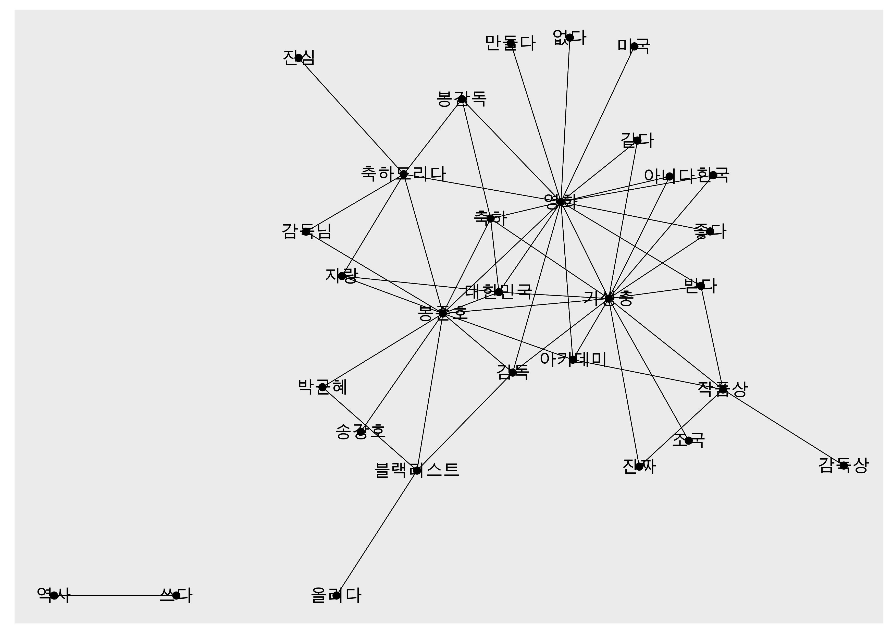
```

---

```{r, echo=FALSE, out.width="80%", out.height="80%"}

```

---

##### 그래프 다듬기

```{r eval=F}
# 한글 폰트 설정
library(showtext)
font_add_google(name = "Nanum Gothic", family = "nanumgothic")
showtext_auto()
```


---

##### 엣지와 노드의 색깔, 크기, 텍스트 위치 수정

- `ggraph(layout = "fr")`: 네트워크 형태 결정
  - 난수를 이용해 매번 형태 달라짐 → `set.seed()`로 난수 고정

```{r eval=FALSE}
set.seed(1234)                              # 난수 고정
ggraph(graph_comment, layout = "fr") +      # 레이아웃

  geom_edge_link(color = "gray50",          # 엣지 색깔
                 alpha = 0.5) +             # 엣지 명암

  geom_node_point(color = "lightcoral",     # 노드 색깔
                  size = 5) +               # 노드 크기

  geom_node_text(aes(label = name),         # 텍스트 표시
                 repel = T,                 # 노드밖 표시
                 size = 5,                  # 텍스트 크기
                 family = "nanumgothic") +  # 폰트

  theme_graph()                             # 배경 삭제
```

---

```{r, echo=FALSE, out.width="80%", out.height="80%"}
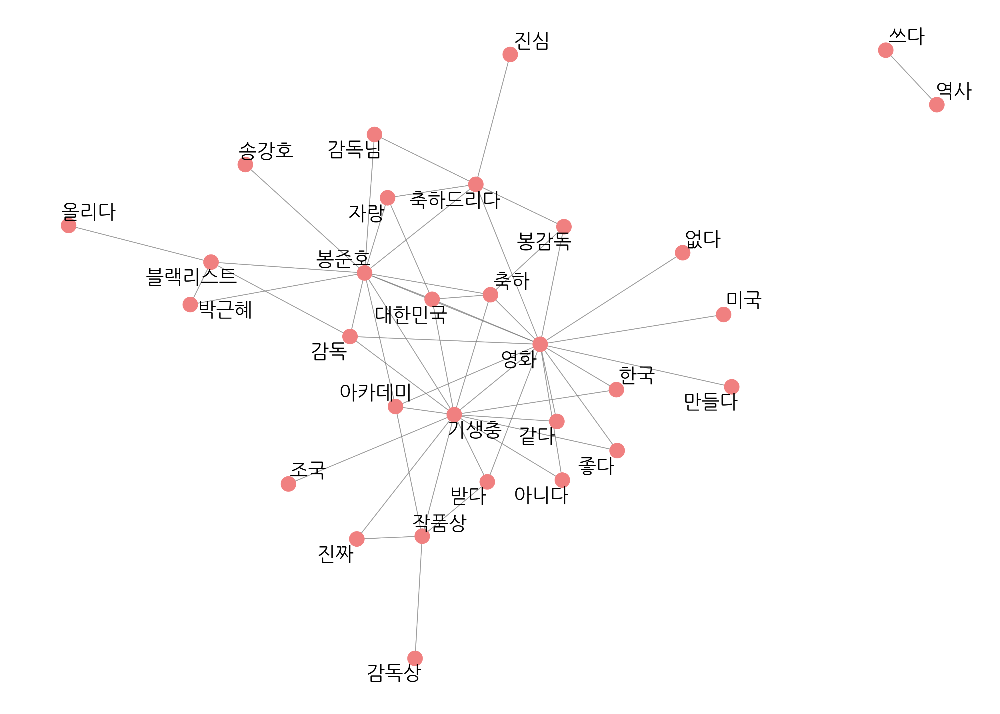
```

---


##### 네트워크 그래프 함수 만들기

```{r}
word_network <- function(x) {
  ggraph(x, layout = "fr") +
    geom_edge_link(color = "gray50",
                   alpha = 0.5) +
    geom_node_point(color = "lightcoral",
                    size = 5) +
    geom_node_text(aes(label = name),
                   repel = T,
                   size = 5,
                   family = "nanumgothic") +
    theme_graph()
}
```


```{r eval=F}
set.seed(1234)
word_network(graph_comment)
```

---

####  유의어 처리하기

- 유의어(synonyms): 표현은 다르지만 의미가 비슷한 단어
  - ex) `"감독"`, `"봉감독"`, `"봉준호감독"`
- 유의어 통일하기: 네트워크 구조가 간결해지고 단어의 관계가 좀 더 분명하게 드러남

---

```{r, results='hide'}
# 유의어 처리하기
comment <- comment %>%
  mutate(word = ifelse(str_detect(word, "감독") &
                      !str_detect(word, "감독상"), "봉준호", word),
         word = ifelse(word == "오르다", "올리다", word),
         word = ifelse(str_detect(word, "축하"), "축하", word))

# 단어 동시 출현 빈도 구하기
pair <- comment %>%
  pairwise_count(item = word,
                 feature = id,
                 sort = T)

# 네트워크 그래프 데이터 만들기
graph_comment <- pair %>%
  filter(n >= 25) %>%
  as_tbl_graph()

# 네트워크 그래프 만들기
library(ggraph)
set.seed(1234)
word_network(graph_comment)
```

---

```{r, echo=FALSE, out.width="80%"}
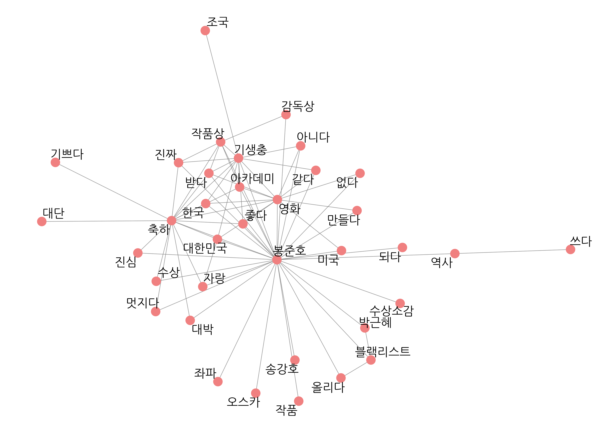
```

---

#### 연결 중심성과 커뮤니티 표현하기

- 네트워크 그래프는 단어 노드가 많아 어떤 단어 노드 중심으로 해석할지 판단 어려움
- 연결 중심성과 커뮤니티를 표현하면 단어의 관계를 더 분명하게 파악할 수 있다

--


##### 연결 중심성(degree centrality)
- 노드가 다른 노드들과 얼마나 밀접하게 연결되는지 나타낸 값
- 연결 중심성으로 노드 크기를 조정하면 어떤 단어를 눈여겨봐야 할지 판단하기 쉬워진다

```{r, echo=FALSE, out.width="50%"}
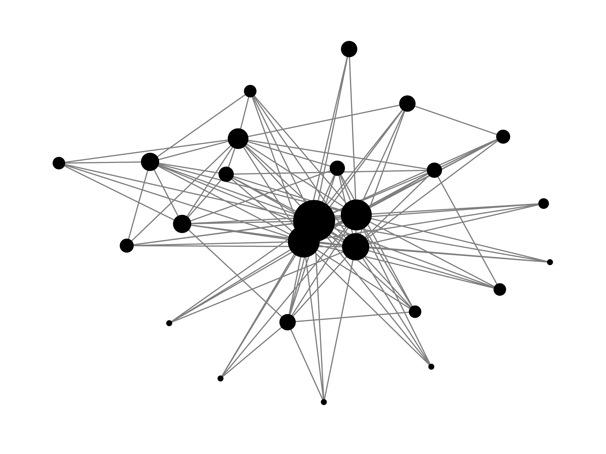
```

---

#### 연결 중심성과 커뮤니티 표현하기

- 네트워크 그래프는 단어 노드가 많아 어떤 단어 노드 중심으로 해석할지 판단 어려움
- 연결 중심성과 커뮤니티를 표현하면 단어의 관계를 더 분명하게 파악할 수 있다


##### 커뮤니티(community)

- 단어 간의 관계가 가까워 빈번하게 연결된 노드 집단
- 노드를 커뮤니티별로 구분 지어 서로 다른 색으로 표현하면 네트워크 구조를 이해하기 쉬워진다

```{r, echo=FALSE, out.width="50%"}
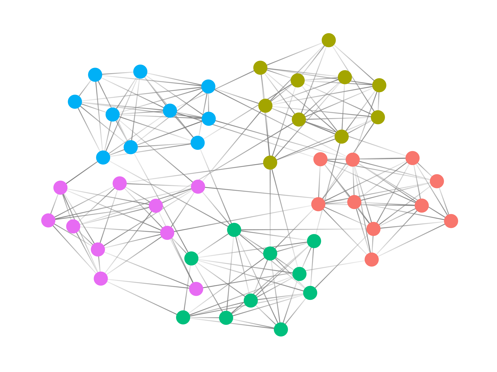
```


---

##### 1. 네트워크 그래프 데이터에 연결 중심성, 커뮤니티 변수 추가하기

```{r graph_comment, eval=F}
set.seed(1234)
graph_comment <- pair %>%
  filter(n >= 25) %>%
  as_tbl_graph(directed = F) %>%
  mutate(centrality = centrality_degree(),    # 연결 중심성 #<<
         group = as.factor(group_infomap()))  # 커뮤니티    #<<

graph_comment
```

`r fontawesome("lightbulb")` `tidygraph` 패키지의 연결 중심성 지표, 커뮤니티 탐지 알고리즘: [tidygraph.data-imaginist.com](https://tidygraph.data-imaginist.com)

---
```{r ref.label="graph_comment", echo=F, highlight.output = c(6:14)}

```

---

#### 2. 네트워크 그래프에 연결 중심성, 커뮤니티 표현하기

```{r eval=F}
set.seed(1234)
ggraph(graph_comment, layout = "fr") +      # 레이아웃

  geom_edge_link(color = "gray50",          # 엣지 색깔
                 alpha = 0.5) +             # 엣지 명암

  geom_node_point(aes(size = centrality,    # 노드 크기 #<<
                      color = group),       # 노드 색깔 #<<
                  show.legend = F) +        # 범례 삭제 #<<
  scale_size(range = c(5, 15)) +            # 노드 크기 범위 #<<

  geom_node_text(aes(label = name),         # 텍스트 표시
                 repel = T,                 # 노드밖 표시
                 size = 5,                  # 텍스트 크기
                 family = "nanumgothic") +  # 폰트

  theme_graph()                             # 배경 삭제
```


---

```{r, echo=FALSE, out.width="80%"}
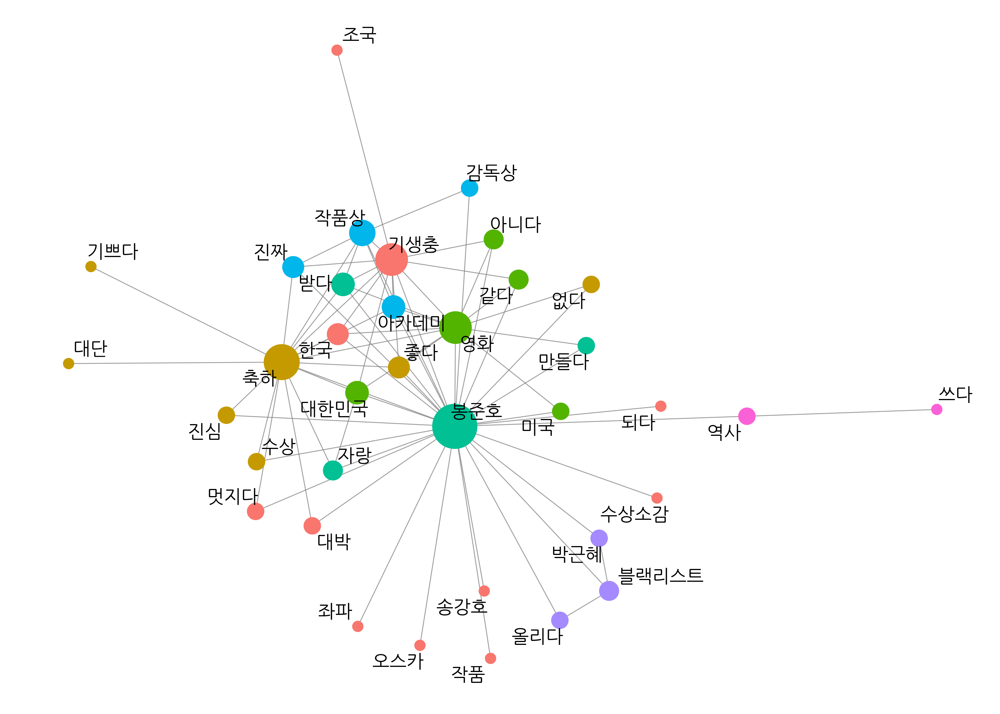
```


---

name: 03-3
class: title1

03-3 단어 간 상관 분석:   
Phi coefficient

---

##### 동시 출현 빈도의 한계
- 대부분의 단어와 자주 함께 사용되는 단어쌍 다수
    - ex) `"영화"-"기생충"`
- 다른 단어에 비해 상대적으로 자주 함께 사용된 단어가 무엇인지 살펴봐야 한다


--

##### 파이 계수(phi coefficient)
- 두 단어가 함께 사용되는 경우가 각각 사용되는 경우에 비해 얼마나 많은지 나타낸 지표
- 상대적으로 관련성이 큰 단어 파악하는데 활용
 - 어떤 단어와 자주 함께 사용되지만 다른 단어와는 자주 함께 사용되지 않는 단어
 
---

##### 파이 계수의 의미

- X, Y 두 단어가 있을 때, 여러 텍스트에서 두 단어의 사용 여부를 놓고 가능한 모든 경우
  - X, Y 모두 있음( $a$ )
  - X, Y 모두 없음( $d$ )
  - X만 있음( $b$ )
  - Y만 있음( $c$ )

<br10>

.center[
```{r, echo=F, out.width="60%", out.height="60%"}
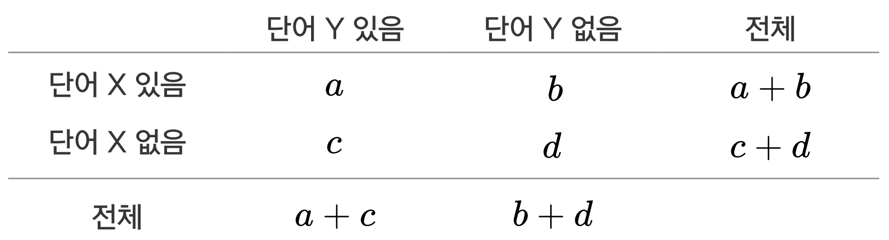
```
]


--

<br> 

$$\phi=\frac{ad-bc}{\sqrt{(a+b)(c+d)(a+c)(b+d)}}$$


---

##### 파이 계수의 의미

- -1 ~ +1
  - +1에 가까울수록 두 단어가 자주 함께 사용되어 관련성이 크다는 의미
  - -1에 가까울수록 함께 사용되는 경우가 드물어 관련성이 작다는 의미
  

---


#### 파이 계수 구하기

- `widyr::pairwise_cor()`
  - `item`: 단어
  - `feature`: 텍스트 구분 기준
  - `sort = T`: 파이 계수 높은순 정렬

.pull-left[

```{r word_cors, results='hide'}
word_cors <- comment %>%
  add_count(word) %>%
  filter(n >= 20) %>%
  pairwise_cor(item = word, 
               feature = id, 
               sort = T)

word_cors
```

`r fontawesome("lightbulb")`  `add_count()` 원자료에 빈도 나타낸 변수 추가

]

--

.pull-right[

```{r ref.label="word_cors", echo=F}

```


]


 
---


#### 특정 단어와 관련성이 큰 단어 살펴보기


.pull-left[

```{r}
word_cors %>%
  filter(item1 == "대한민국")
```
]

.pull-right[
```{r}
word_cors %>%
  filter(item1 == "역사")
```
]

---


#### 파이 계수로 막대 그래프 만들기

##### 1. 관심 단어별로 파이 계수가 큰 단어 추출하기

```{r}
# 관심 단어 목록 생성
target <- c("대한민국", "역사", "수상소감", "조국", "박근혜", "블랙리스트")

top_cors <- word_cors %>%
  filter(item1 %in% target) %>%
  group_by(item1) %>%
  slice_max(correlation, n = 8)
```

---


##### 2. 막대 그래프 만들기


```{r p_top_cors, fig.show='hide'}
# 그래프 순서 정하기
top_cors$item1 <- factor(top_cors$item1, levels = target)

library(ggplot2)
ggplot(top_cors, aes(x = reorder_within(item2, correlation, item1),
                 y = correlation,
                 fill = item1)) +
  geom_col(show.legend = F) +
  facet_wrap(~ item1, scales = "free") +
  coord_flip() +
  scale_x_reordered() +
  labs(x = NULL) +
  theme(text = element_text(family = "nanumgothic"))
```

---

```{r ref.label="p_top_cors", echo=F, out.width="90%"}
```

---

#### 파이 계수로 네트워크 그래프 만들기


##### 1. 네트워크 그래프 데이터 만들기. 연결 중심성과 커뮤니티 추가하기

```{r}
set.seed(1234)
graph_cors <- word_cors %>%
  filter(correlation >= 0.15) %>%
  as_tbl_graph(directed = F) %>%
  mutate(centrality = centrality_degree(),
         group = as.factor(group_infomap()))
```

---

##### 2. 네트워크 그래프 만들기

```{r eval=F}
set.seed(1234)
ggraph(graph_cors, layout = "fr") +

  geom_edge_link(color = "gray50",
                 aes(edge_alpha = correlation,   # 엣지 명암
                     edge_width = correlation),  # 엣지 두께
                 show.legend = F) +              # 범례 삭제
  scale_edge_width(range = c(1, 4)) +            # 엣지 두께 범위

  geom_node_point(aes(size = centrality,
                      color = group),
                  show.legend = F) +
  scale_size(range = c(5, 10)) +

  geom_node_text(aes(label = name),
                 repel = T,
                 size = 5,
                 family = "nanumgothic") +

  theme_graph()
```

---


```{r, echo=F, out.width="80%"}
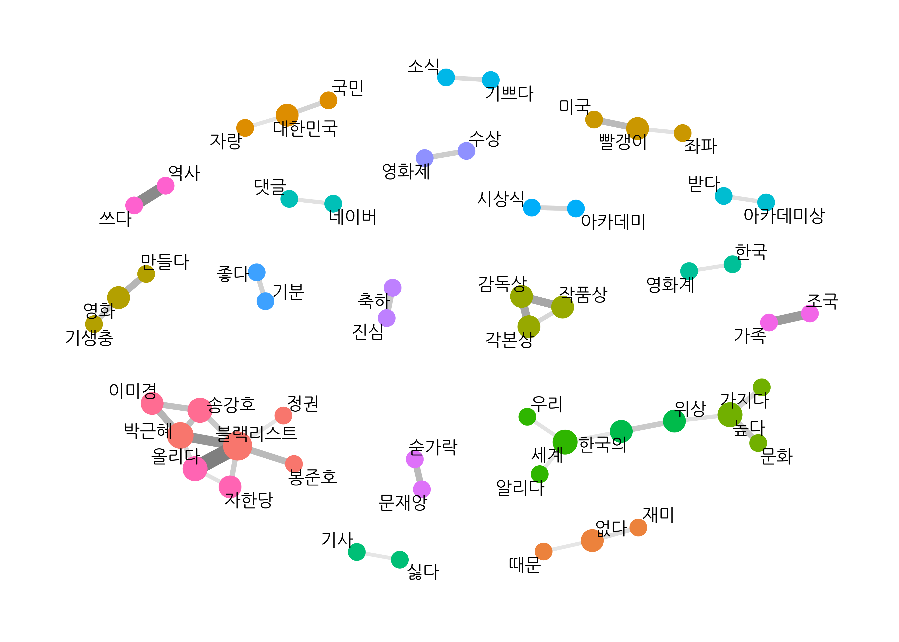
```


---


name: 03-4
class: title1

03-4
연이어 사용된 단어쌍 분석:  
n-gram

---


- 같은 단어도 함께 사용된 단어에 따라 의미가 달라짐
- 어떤 단어는 다른 단어와 연결되어 새로운 의미를 만들어냄
  - ex)
      - '사과를 먹다', '사과를 하다'
      - '감을 잡다', '귀가 얇다'

--


- 동시 출현 빈도와 파이 계수의 한계: 단어가 함께 사용된 횟수만 고려
  - 단어가 연결될 때 생기는 의미 무시
  - 이해하기 어려운 단어쌍 등장

--


<br>

- 단어가 연결될 때 생기는 의미를 고려하려면 **'자주 연이어 사용된 단어'**를 살펴봐야 한다


---

#### 엔그램(n-gram)
- 연이어 사용된 n개의 단어
  - 두 단어 연속: 바이그램(bigram) 또는 2-gram
  - 세 단어 연속: 트라이그램(trigram) 또는 3-gram

.center[
```{r, echo=F, out.width="70%"}
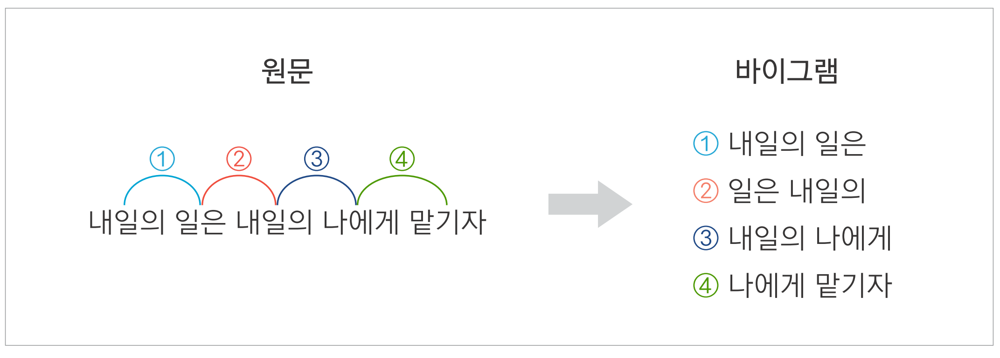
```
]


--


- **텍스트를 엔그램으로 토큰화하면**
  - 단어 앞뒤에 연이어 사용된 단어를 함께 살펴봄: 얼마나 자주 '연이어' 사용된 단어쌍인가?
  - 단어가 연결될 때 생기는 의미와 맥락을 이해할 수 있음
  - 대다수의 텍스트에 사용된 평범한 단어쌍이 아니라 분명한 의미를 드러내는 단어쌍 발견

---


#### 엔그램으로 토큰화하기

**샘플 텍스트로 엔그램 토큰화해보기**
<br-back-10>
- `tidytext::unnest_tokens()`
  - `token = "ngrams"`
  - `n`: 기준 단어 수

```{r R.options=list(pillar.min_chars = Inf, tibble.width = 100, width = 100)}
text <- tibble(value = "대한민국은 민주공화국이다. 대한민국의 주권은 국민에게 있고, 모든 권력은 국민으로부터 나온다.")

text
```

---

.pull-left[


```{r}
# 바이그램 토큰화
text %>%
  unnest_tokens(input = value,
                output = word,
                token = "ngrams",
                n = 2)  #<<
```
]

.pull-right[


```{r}
# 트라이그램 토큰화
text %>%
  unnest_tokens(input = value,
                output = word,
                token = "ngrams",
                n = 3) #<<
```
]


---

#### 기사 댓글로 바이그램 만들기

##### (1) 명사, 동사, 형용사 추출하기

- `comment_pos` 이용: 댓글을 형태소로 토큰화 후 품사별로 행 분리
- 명사, 동사, 형용사를 추출해 결합한 후 두 글자 이상만 남김

```{r}
comment_new <- comment_pos %>%
  separate_rows(word, sep = "[+]") %>%
  filter(str_detect(word, "/n|/pv|/pa")) %>%
  mutate(word = ifelse(str_detect(word, "/pv|/pa"),
                       str_replace(word, "/.*$", "다"),
                       str_remove(word, "/.*$"))) %>%
  filter(str_count(word) >= 2) %>%
  arrange(id)
```

---


##### (2) 유의어 처리하기


```{r}
comment_new <- comment_new %>%
  mutate(word = ifelse(str_detect(word, "감독") &
                      !str_detect(word, "감독상"), "봉준호", word),
         word = ifelse(word  == "오르다", "올리다", word),
         word = ifelse(str_detect(word, "축하"), "축하", word))
```

---


##### (3) 한 댓글이 하나의 행이 되도록 결합하기


```{r}
comment_new %>%
  select(word)
```

---

##### (3) 한 댓글이 하나의 행이 되도록 결합하기

```{r}
line_comment <- comment_new %>%
  group_by(id) %>%
  summarise(sentence = paste(word, collapse = " "))

line_comment
```


---

##### (4) 바이그램으로 토큰화하기


```{r}
bigram_comment <- line_comment %>%
  unnest_tokens(input = sentence,
                output = bigram,
                token = "ngrams",
                n = 2)

bigram_comment
```

---


#### 연이어 사용된 단어쌍 빈도 구하기


##### 1. 바이그램 분리하기

```{r}
# 바이그램 분리하기
bigram_seprated <- bigram_comment %>%
  separate(bigram, c("word1", "word2"), sep = " ")

bigram_seprated
```

---

##### 2. 단어쌍 빈도 구하기

.pull-left[

```{r pair_bigram, results='hide'}
# 단어쌍 빈도 구하기
pair_bigram <- bigram_seprated %>%
  count(word1, word2, sort = T) %>%
  na.omit()

pair_bigram
```

]
.pull-right[

```{r ref.label="pair_bigram", echo=F}
```
]

<br>
`r fontawesome("lightbulb")` `na.omit()`: 결측치 행 제거: 한 단어로 된 문장은 바이그램으로 토큰화하면 `NA`가 됨 <br>&nbsp;&nbsp;&nbsp;&nbsp;ex) '축하합니다', '멋집니다'

---

##### 3. 단어쌍 살펴보기

<br10>

.pull-left[
```{r}
# 동시 출현 단어쌍
pair %>% #<<
  filter(item1 == "대한민국")
```
]
.pull-right[
```{r}
# 바이그램 단어쌍
pair_bigram %>% #<<
  filter(word1 == "대한민국")
```
]

---


#### 엔그램으로 네트워크 그래프 만들기


```{r eval=F}
# 네트워크 그래프 데이터 만들기
graph_bigram <- pair_bigram %>%
  filter(n >= 8) %>%
  as_tbl_graph()

# 네트워크 그래프 만들기
set.seed(1234)
word_network(graph_bigram)
```

```{r, echo=F, out.width="40%"}
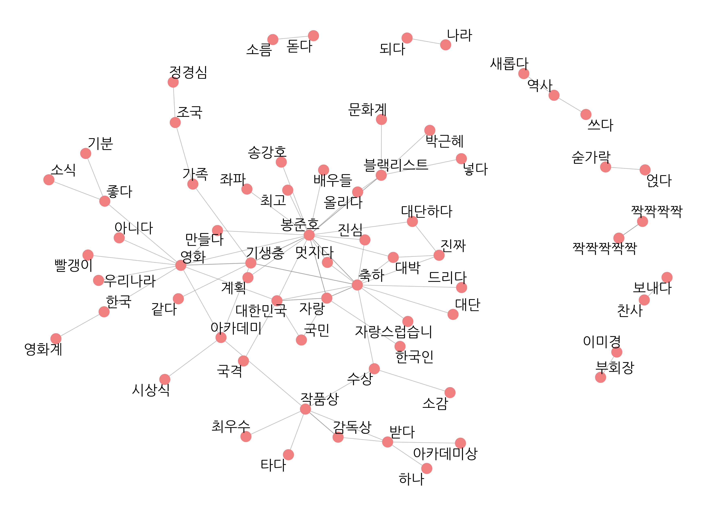
```

---

```{r, echo=F, out.width="80%"}

```


---


##### 유의어 통일하고 네트워크 그래프 다시 만들기

- `bigram_seprated`의 유의어 통일, 같은 단어 연속 단어쌍 제거
- 단어쌍 빈도 구하고 결측치 제거

```{r}
# 유의어 처리
bigram_seprated <- bigram_seprated %>%
  mutate(word1 = ifelse(str_detect(word1, "대단"), "대단", word1),
         word2 = ifelse(str_detect(word2, "대단"), "대단", word2),

         word1 = ifelse(str_detect(word1, "자랑"), "자랑", word1),
         word2 = ifelse(str_detect(word2, "자랑"), "자랑", word2),

         word1 = ifelse(str_detect(word1, "짝짝짝"), "짝짝짝", word1),
         word2 = ifelse(str_detect(word2, "짝짝짝"), "짝짝짝", word2)) %>%

  # 같은 단어 연속 제거
  filter(word1 != word2)

# 단어쌍 빈도 구하기
pair_bigram <- bigram_seprated %>%
  count(word1, word2, sort = T) %>%
  na.omit()
```


---

```{r eval=F}
# 네트워크 그래프 데이터 만들기
set.seed(1234)
graph_bigram <- pair_bigram %>%
  filter(n >= 8) %>%
  as_tbl_graph(directed = F) %>%
  mutate(centrality = centrality_degree(),    # 중심성
         group = as.factor(group_infomap()))  # 커뮤니티
```

---

```{r eval=F}
# 네트워크 그래프 만들기
set.seed(1234)
ggraph(graph_bigram, layout = "fr") +         # 레이아웃

  geom_edge_link(color = "gray50",            # 엣지 색깔
                 alpha = 0.5) +               # 엣지 명암

  geom_node_point(aes(size = centrality,      # 노드 크기
                      color = group),         # 노드 색깔
                  show.legend = F) +          # 범례 삭제
  scale_size(range = c(4, 8)) +               # 노드 크기 범위

  geom_node_text(aes(label = name),           # 텍스트 표시
                 repel = T,                   # 노드밖 표시
                 size = 5,                    # 텍스트 크기
                 family = "nanumgothic") +    # 폰트

  theme_graph()                               # 배경 삭제
```

---

```{r, echo=F, out.width="80%"}
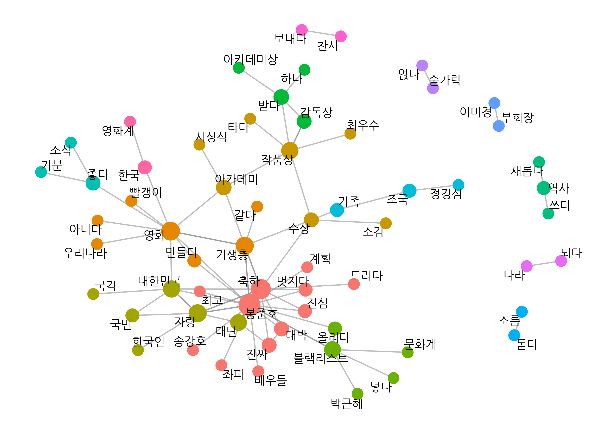
```

---
- 자주 연이어 사용된 단어쌍 중심으로 네트워크 형성
- 단어의 맥락과 의미를 구체적으로 이해할 수 있음
- 개별 단어의 빈도는 낮지만 자주 연이어 사용되고 함께 사용할 때 분명한 의미 지니는 단어쌍 발견
  - ex) '이미경-부회장', '조국-가족'

```{r, echo=F, out.width="60%"}

```

---

##### 어떤 방법으로 네트워크 그래프를 만드는 게 좋을까
<br10>
- 각 방법의 특징 다르므로 분석 목적에 맞게 선택
- 세 가지 방법 모두 사용해 분석 결과 비교하면 텍스트를 다각도로 이해할 수 있음

<br>


---

- **동시 출현 빈도**: 자주 사용된 단어 중심으로 단어들의 관계 표현
<br10>

```{r, echo=F, out.width="75%"}

```

---

- **파이 계수**
  - 관련성이 큰 단어쌍 중심으로 표현
  - 단어 군집을 잘 드러내고 싶을 때

```{r, echo=F, out.width="70%"}

```

---

- **엔그램**
  - 연이어 사용될 때 의미를 지니는 단어쌍 중심으로 표현
  - 단어들이 전반적으로 어떤 관계를 형성하고 있는지 표현할 때

```{r, echo=F, out.width="70%"}

```

